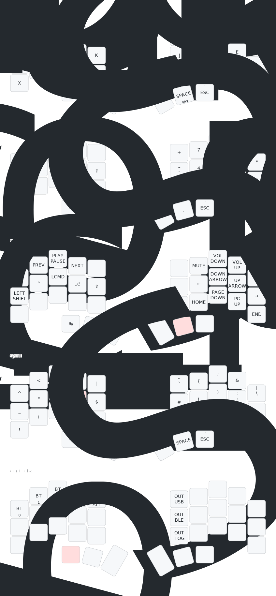

# Saurus keyboard ZMK config

This is my personal config for custom keyboard I call Saurus.

For the layout I use modified Night layout that borrows some ideas from Graphite (which I used before) with I use ZMK Home Row Mod.

